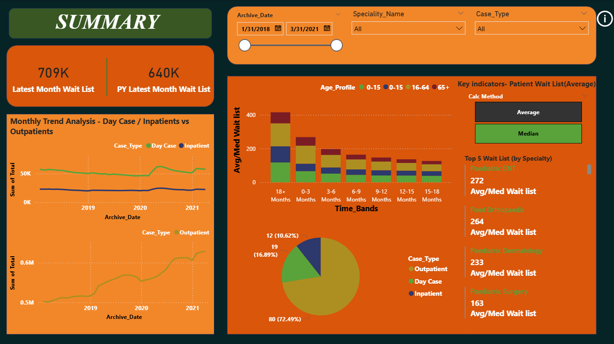
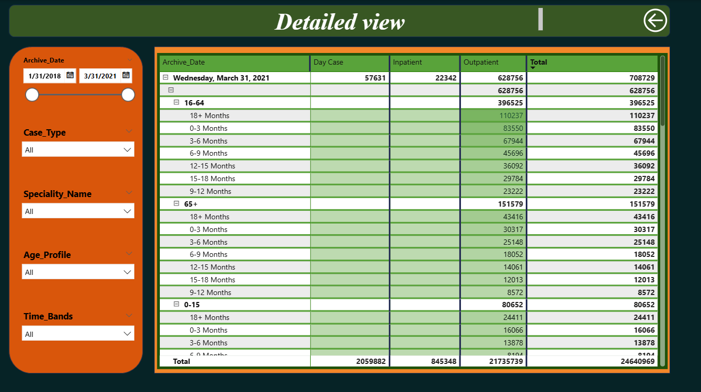

# 🏥 Healthcare Waitlist Analysis Dashboard (Power BI)

## 📊 Project Overview

This Power BI dashboard analyzes healthcare waitlist data to understand trends in **Inpatient, Outpatient, and Day Case services** across multiple years.

The goal of the project is to identify patterns in patient waiting lists and support better healthcare resource planning.

---

## 📷 Dashboard Preview

### Summary View

### Detailed View

---

## 🔍 Key Insights

* Outpatient cases have the highest waitlist volume.
* Day Case trends show gradual fluctuation over time.
* Certain age groups experience longer waiting periods.
* Monthly waitlist patterns highlight seasonal demand changes.

---

## 📈 Features of the Dashboard

* KPI indicators for waitlist statistics
* Case Type trend analysis
* Age profile breakdown
* Wait time distribution
* Interactive filters and slicers

---

## 🛠 Tools & Technologies

* Power BI Desktop
* Power Query
* DAX (Data Analysis Expressions)
* Data Modeling

---

## 📁 Files Included

* `health_waitlist_dashboard.pbix` – Power BI report
* `dashboard_summary.png` – Dashboard preview
* `dashboard_detailed.png` – Detailed analysis view

---

## 🚀 How to Use

1. Download the `.pbix` file
2. Open it in **Power BI Desktop**
3. Explore the interactive dashboard

---

